# Getting started with PDMS UX

### ***Prerequisites***
>	You should have completed the setup of Yubikey and SAW before setting up PCD on your dev box. 
   We are not using SAW to run the dev environment but to request access to some subscriptions we need SAW. 
   Please refer [here](https://microsoft.sharepoint-df.com/teams/NGPCommonInfra/_layouts/OneNote.aspx?id=%2Fteams%2FNGPCommonInfra%2FSiteAssets%2FNGP%20Common%20Infra%20Notebook&wd=target%28MS%20CS.one%7CC345F8DF-0E82-4FF2-A1A9-B6B87CD51FCD%2FSAW%20Setup%20using%20Yubikey%7C38176844-54AC-4236-B9C5-5B99D441ABA8%2F%29) for setting up SAW and Yubikey

</br>

## 1. Basic tools required

1. [Install Visual Studio Enterprise](https://www.visualstudio.com/downloads/) with workloads:
    1. `ASP.NET and web development`. Make sure `.NET Framework 4.7 development
       tools` item is selected:  
         
    2. `Node.js development`
    3. `.NET Core cross-platform development`
2. [Install Visual Studio
   Code](https://code.visualstudio.com/docs/setup/windows) for developing
   Markdown documentation. Install all the suggested extensions.
3. [Install Node.js](https://nodejs.org/en/download/) v8.x (LTS), use all
   default configurations when installing.
4. [Install Git](https://git-scm.com/downloads), use all default configurations
   when installing.
5. [Install Chrome browser](https://www.google.com/chrome/).


----------
</br>

## 2. Permission/Access Requests to be raised
1. Make sure you are member of security group - 'TM-NgpCommonInfra', **For this contact jitendra.guptha@microsoft.com or current owner of the service**, if it is *not* possible, follow the below steps:
   1. Navigate to https://aka.ms/oneidenity from your SAW
   2. Go to "Create Request - Security Groups"
   3. For 'Domain' use 'ame' and for 'Group Name' use 'TM-NgpCommonInfra' and press Next
   4. Navigate to the 'Members' section, in the text box enter your alias and press Add Members
   5. Click "Modify"
   6. Give "New joinee to the PCD team" as justifiction
   7. A request will be raised for you and wait for it’s approval

2. Request access to the AME NonProd JIT, this should be done only after getting approval in the last step.
   1. Navigate to https://jitaccess.security.core.windows.net 
   2. Click on 'Request Access'
   3. Enter these values in the form:
      1. WorkItem Source - 'Other'
      2. WorkItem Id - 'NonProd Request'
      3. Justification - 'New joinee to the PCD Development' or any other justification depending on your request
      4. Resource Type  - 'Subscription'
      5. Subscription Id - 'b4b176cf-fe78-4b59-bd1a-9b8c11536f4d'
      6. Access level - 'Contributor'
      7. Click on 'Validate'
      8. Submit the request
      9. The approval will be accepted immediately once you submit it, if it is rejected please make sure that you are a valid member of 'TM-NgpCommonInfra' security group
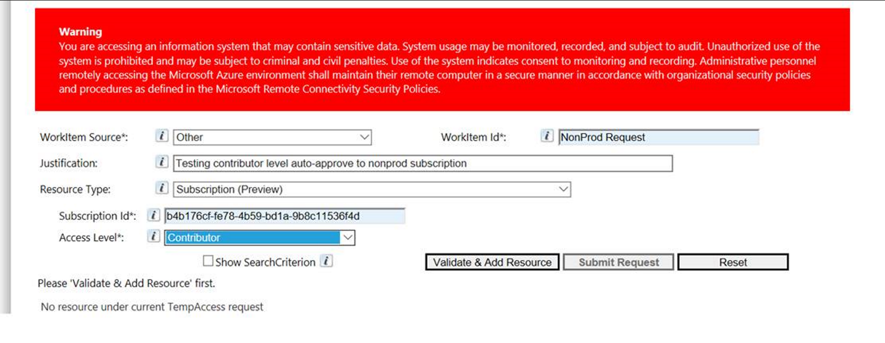

----------
</br>

## 3. Build and Deployment Setup

1. In Visual Studio:
    1. Go to Tools -> Options -> Projects and Solutions -> Web Package
       Management -> External Web Tools
    2. Make sure the order of search is:
        1. `.\node_modules\.bin`
        2. `$(PATH)`
        3. Everything else.  
          
2. You will be using the AME account in your non-SAW machine, but the AME authentication is expected to be done only in SAW, so here you will have to configure the AME certs in your non-SAW machine to provide authentication
   1. If you have completed the Yubikey setup succesfully, if you go to the tool - "certmgr.msc" -> "Certificate - Current User" -> "Personal" -> "Certificates"
   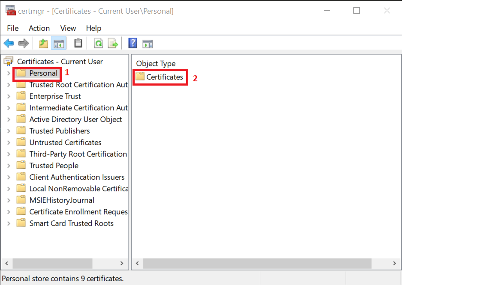
   2. Select the certificate issued by AME SC CA 01
   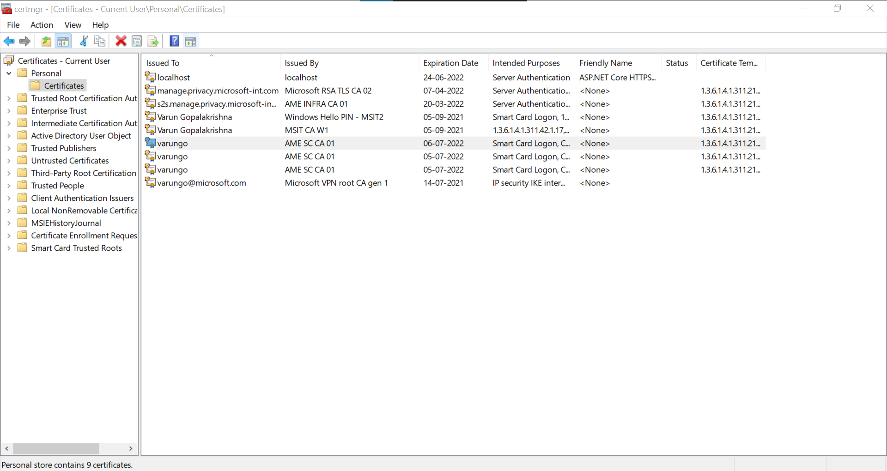
   3. You should be seeing something like this:
   
      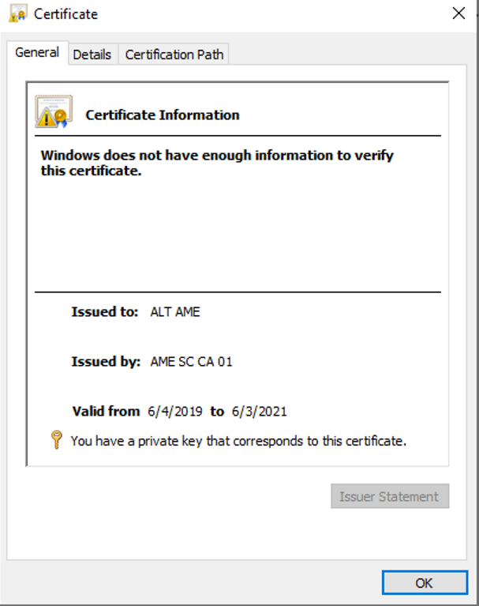
   4. Now open the powershell in elevated mode
   5. Then run the following script:
   
      ```
         invoke-webrequest "http://crl.microsoft.com/pkiinfra/Certs/BY2PKISCCA01.AME.GBL_AME SC CA 01(3).crt" -OutFile c:\windows\temp\by2SC.cer 
         invoke-webrequest "http://crl.microsoft.com/pkiinfra/Certs/BL2PKISCCA01.AME.GBL_AME%20SC%20CA%2002(3).crt" -OutFile c:\windows\temp\scca2.crt
         invoke-webrequest "http://crl.microsoft.com/pkiinfra/Certs/AMEROOT_ameroot.crt" -OutFile c:\windows\temp\ameroot.cer
         invoke-webrequest "http://crl.microsoft.com/pkiinfra/Certs/AM3PKIINTCA01.AME.GBL_AME%20Infra%20CA%2003.crt" -OutFile c:\windows\temp\am3int.cer
         invoke-webrequest "http://crl.microsoft.com/pkiinfra/Certs/MEL01PKIINTCA01.AME.GBL_AME%20Infra%20CA%2004.crt" -OutFile c:\windows\temp\mel01int.cer
         invoke-webrequest "http://crl.microsoft.com/pkiinfra/Certs/BY2PKIINTCA01.AME.GBL_AME%20Infra%20CA%2001(2).crt" -OutFile c:\windows\temp\by2int.cer
               
         import-Certificate -CertStoreLocation cert:\LocalMachine\CA\ -FilePath c:\windows\temp\by2SC.cer
         import-Certificate -CertStoreLocation cert:\LocalMachine\CA\ -FilePath c:\windows\temp\scca2.crt
         import-Certificate -CertStoreLocation cert:\LocalMachine\CA\ -FilePath c:\windows\temp\am3int.cer
         import-Certificate -CertStoreLocation cert:\LocalMachine\CA\ -FilePath c:\windows\temp\mel01int.cer
         import-Certificate -CertStoreLocation cert:\LocalMachine\CA\ -FilePath c:\windows\temp\by2int.cer 
         Import-Certificate -CertStoreLocation Cert:\LocalMachine\root\ -FilePath c:\windows\temp\ameroot.cer 
      ```
   3. Now you should be seeing something like this:
   
      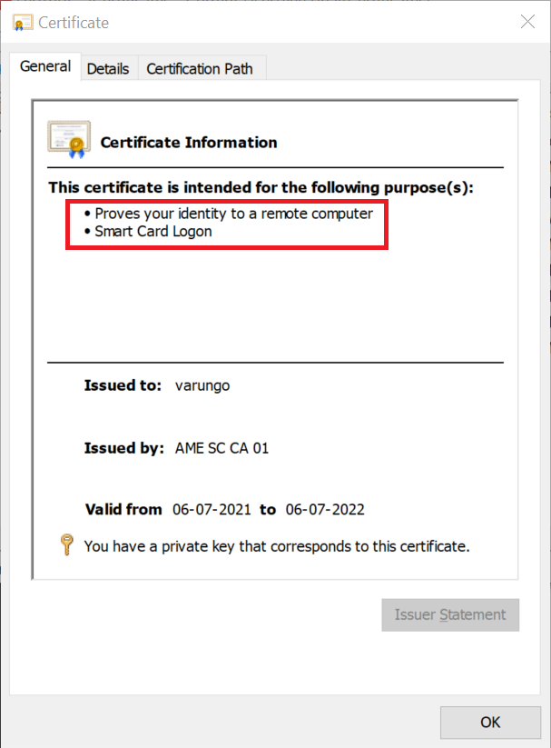

3. Clone this repo locally
    1. Click the `Clone` button on top right corner (if you happen to be on VSTS
       site) and download to VS2019 directly.
4. Open powershell in Administrator mode
   1. Install Azure RM powershell module. We need this to talk to key vault and get all the needed certs to install. In an elevated powershell window, run the following command `Install-Module -Name AzureRM`
   2. Go to root of the ComplianceServices repo
   3. Go to src\PCD
   4. Install the necessary certificates
      1. Run the command - Product\Setup\devbox.cmd
      2. An MS login portal would appear and provide your AME account in it i.e. <your_alias>@ame.gbl
      3. Click on the "sign in using a certificate" option
   
         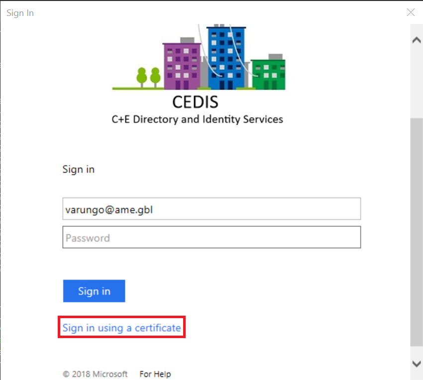
      4. Connect the yubikey
      5. Choose the "AME certificate", click "OK"
   
         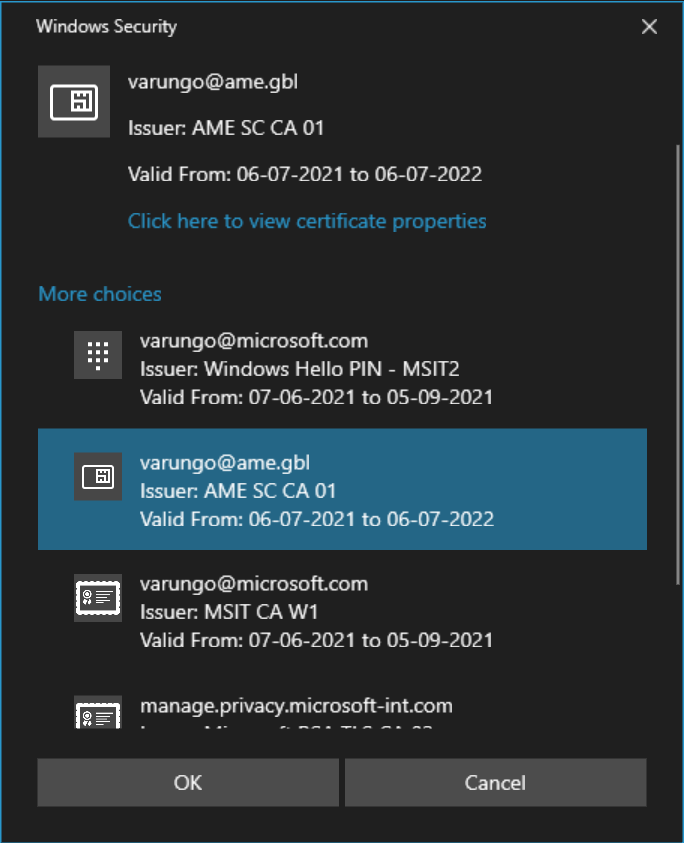
      6. Choose the yubikey option, make sure that the yubikey has an active connection by touching the copper part of the yubikey and then click OK

         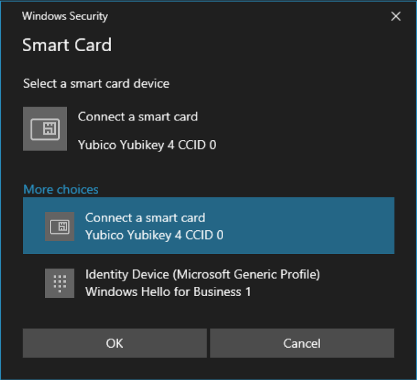
      7. Enter your PIN in the next prompt
      8. If all certs and dependencies have installed successfully you should be seeing something like this:
   
         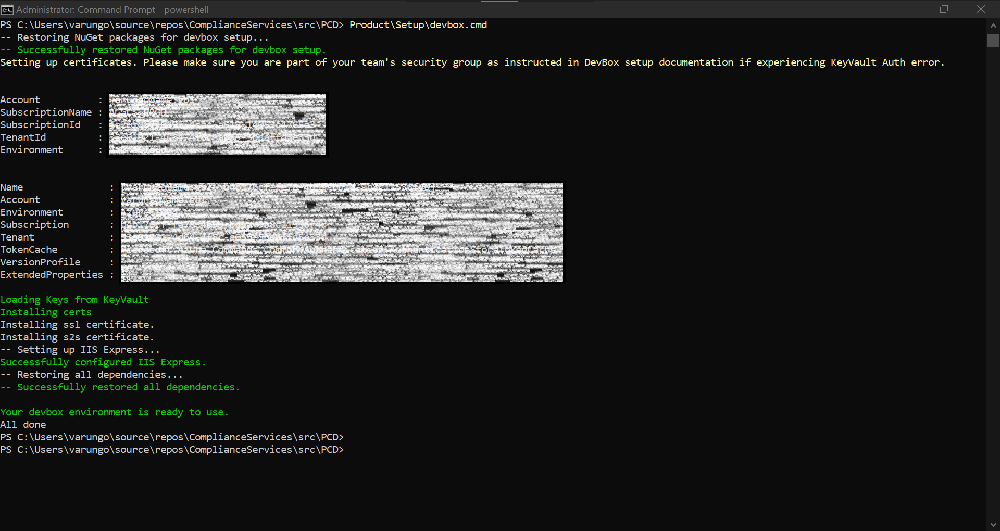
   
5. Restore and clean the npm and nuget packages by running the command - `Product\Build\restore_devbox.cmd`
6. PCD project have a dependency on the PXS project so you should be building some of it's sub projects before stepping into PCD
   1. Open `src\PXS\Product\PrivacyExperienceSvc.sln` in Visual Studio 2019
   2. Build the project - `PrivacyOperationClient` with the configuration - Debug, x64
   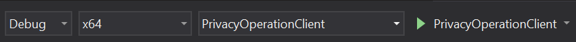
   1. Please note that it is important to build the project in x64 configuration, if build is taken for other configurations it can cause the PCD to crash during runtime

7. Update the hosts file with the PCD's local deployment URL
   1. Open `C:\Windows\System32\drivers\etc\hosts` in a text editor opened in elevated mode
   2. Add the line `127.0.0.1 dev.manage.privacy.microsoft-int.com` at the bottom of the file
8. Now open the solution file src\PCD\pdmsux.sln in Visual Studio 2019
   1. Change the configuration from "Any CPU" to x64
   2. Choose the project ux
   3. Select the down arrow button besides App and choose Chrome as your default.(one time configuration) 
   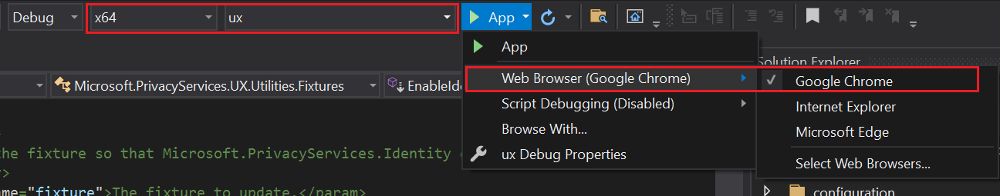
9.  Once the build is completed a browser instance of the chrome will be opened, in that you will be able to see the local PCD portal. Please note that there will be a delay in loading the Portal.

10. Make sure all necessary IDE infra is up and running by inspecting View ->
   Other Windows -> Task Runner Explorer  
    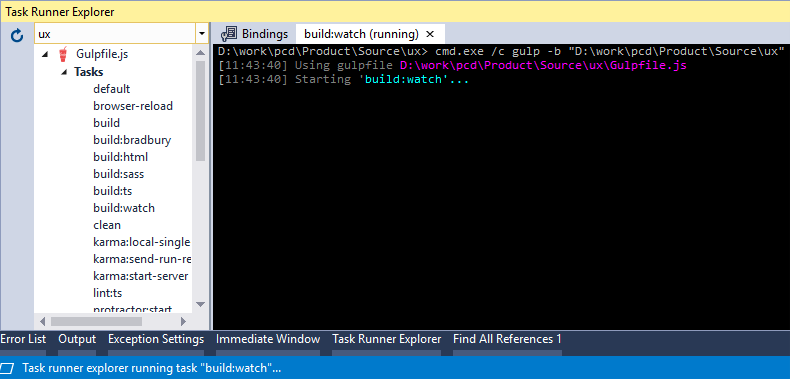  
    1. If Task Runner Explorer can't load `gulpfile.js`, add `C:\Program
       Files\nodejs` at the very top of the External Web Tools list (see one of
       the pre-requisite items above on how to get there).
11. Welcome!

### Note: 
1. Unless explicitly specified in the instructions, you should not use elevated permissions. Most of the development activities should happen in non-elevated mode. 
2. Please note that closing the browser instance launched by the visual studio will cause the termination of the portal!