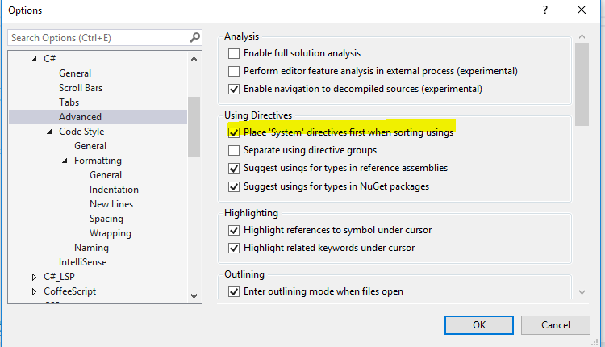

# Development guidances and best practices

## IDE recommendation

1. You can use Visual Studio Enterprise and/or Visual Studio Code to develop this project. Visual Studio Enterprise has better capabilities when it comes to C# debugging/development and generally more feature rich. Visual Studio Code is open source and has better Markdown support for developing documentation.

## Basics

1. Visual Studio will automatically start `build:watch` gulp task. This task will
   automatically compile all TypeScript and SASS files, copy HTML files to
   correct location. If you want to automatically run unit tests, close the tab
   with `build:watch` (accept the prompt to terminate the task that's currently
   running) and start `watch:test:unit` task instead.
    1. Use View -> Other Windows -> Task Runner Explorer menu to see active and
       available gulp tasks.
1. When using Visual Studio Code, start `gulp build:watch` within folder `Product\Source\ux` if you are actively working on scripts.

[Use this endpoint to access local instance.](https://dev.manage.privacy.microsoft-int.com)

## Visual Studio settings

1. Ensure your System using directives are always on the top. Go to Tools -> Options -> Text Editor -> C# ->
   Advanced and under `Using Directives` select `Place System directives first when sorting usings`.



## Consume new version of oneui.angular after npm publish

1. Do `npm install @mee/oneui.angular@<new-version>`
1. This will change both package.json and npm-shrinkwrap.json
1. Send those changes to PR and commit.

## Updating npm dependencies or fixing audit security issues.
1. Run `npm audit` to analyze vulnerabilities and find out which version of the package to install.
1. Install the packages using this new version
1. Ensure that the dependency is pinned to that single version. (No '~' or '^' in the version number).

## Adding a new open source package through npm
1. Make sure that the new package must be registered within [OSS registry.][Site OSS registry]
1. If it is present, please make sure that the appropriate version is listed there. If not listed,
please register that version for internal usage.
1. General guidance about OSS usage can be found [here.][Doc OSS guidance]
1. Make sure to use pinned dependencies.

## Troubleshooting

### NPM related issues

#### What to do when there is a problem with my NPM cache?

#### What to do when devbox setup fails due to NPM module versioning issues?

Follow the steps below to blow away the NPM cache and start fresh:
1. Clean up the global cache. Move contents within `C:\Users\[alias]\AppData\Roaming\npm-cache` to a temp folder.
Remember to replace [alias] with your corpnet username in the path above.
1. Clean up the 'local' cache. Move contents within `[repo-root]\Product\Source\ux\node_modules` to a temp folder.
1. Open cmd in admin mode and run devbox script again.

### Build agent related issues

#### What to do if gulp is not being resolved properly?

This problem usually surfaces in the form of following error:

```shellscript
2018-10-15T17:02:47.5099257Z [17:02:47] Using gulpfile E:\agent_work\181\s\Product\Source\ux\gulpfile.js
2018-10-15T17:02:47.5132862Z C:\Users\svccbld\AppData\Roaming\npm\node_modules\gulp\bin\gulp.js:129
2018-10-15T17:02:47.5133347Z     gulpInst.start.apply(gulpInst, toRun);
2018-10-15T17:02:47.5133598Z                    ^
2018-10-15T17:02:47.5134273Z TypeError: Cannot read property 'apply' of undefined
```

You need to resolve gulp using the "local" NPM cache rather than global:

```shellscript
node_modules\.bin\gulp.cmd <gulp-target>
``` 


[Site OSS registry]: https://ossmsft.visualstudio.com/_oss
[Doc OSS guidance]: https://osgwiki.com/wiki/WDG_Guide_to_Open_Source_Software_(OSS)
