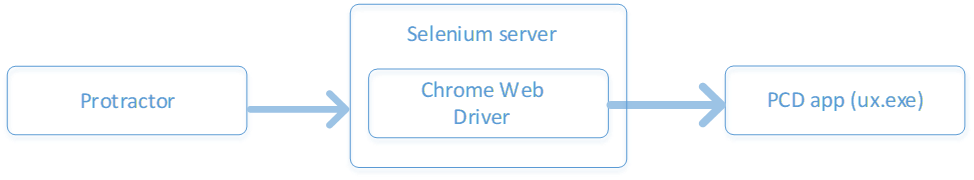
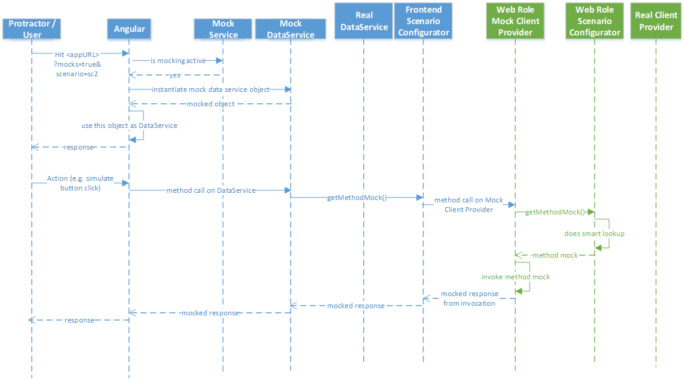
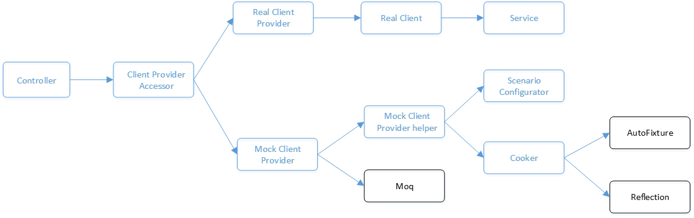

# Integration (I9n) testing

## Architecture overview

I9n tests run using [Protractor][Protractor doc] test framework which utilizes
Chrome headless browser as its web driver implementation. During test run, the
PCD application is hosted locally on a custom https endpoint
<https://localhost:5000>. It does not require any authentication to serve API
requests. [Protractor][Protractor doc] exercises this application by simulating
user action, waiting for application response and doing DOM verification. All
this happens during build time.

The top-level architecture of how everything interacts with each other is as
follows:



The sequence diagram representing call flow of the application within i9n mode
is as follows:



If you are curious to know more about the architecture in detail, please see the
[tech spec][Architecture tech spec]. An overview is also presented in this
[Learning Series talk][Learning Series talk].

## Goals of i9n testing

It is important to keep in mind the goals of i9n testing. This might help you
decide whether a feature will really benefit from i9n testing or not. For most
of your cases where functionality can be tested at the granularity of a
function, unit testing should be sufficient. I9n tests are relevant in the
following situations:

1. Testing user facing workflows (like PRC delete/export). This typically
   involves multiple page navigation.
1. Testing user facing tasks related to system entities (like
   creating/editing/removing data agents).
1. Testing that the required DOM elements of a page are present in the first
   load.

## Developing i9n tests

There are broadly two phases of i9n test development:

### Establish your scenario name

You need to first figure out the name of your scenario that will be tested. The
scenario names are configured in `ux/I9n/Scenario/Scenario.cs` within Web Role
and `ux/frontend/shared/scenario/scenario-types.ts` within frontend.

The name of your scenario is crucial and has a special meaning to the underlying
system. This is because `ScenarioConfigurator` has some smart fallback logic
when it comes to looking up mocked implementations for scenarios. If it can't
find the mocks based on a particular scenario name, it looks for parent mocks by
stripping out the tailing parts of the name. Here is a demonstration:

Suppose the top-level URL looks like
<https://dev.manage.privacy.microsoft-int.com?mocks=true&scenarios=scenario1.case1A.subcase1Aa,scenario2.case2A.subcase2Aa>.
This essentially means that `ScenarioConfigurator` would do lookup for two
scenarios `scenario1.case1A.subcase1Aa` and `scenario2.case2A.subcase2Aa`. The
lookup algorithm works as follows:

```matlab
if mocks present for scenario1.case1A.subcase1Aa or scenario2.case2A.subcase2Aa
    return mocks
else if mocks present for scenario1.case1A or scenario2.case2A
    return mocks
else if mocks present for scenario1 or scenario2
    return mocks
else if mocks present for default
    return mocks
else throw NotImplementedException
```

As you can see, if you name your scenario with the proper hierarchy in mind, it
can make mocks lookup very organic and easier. This typically also results in
writing less code. That's part of the reason why we prefer to use `default`
scenario for most of our use cases.

If you are curious to know more about the design, please see the [Scenario
Modelling tech spec][Scenario modelling tech spec].

### Web role mocking

For i9n tests, we mock the upstream service clients and return strongly typed
objects in response to API calls. The API controller has the capability to
dynamically switch to MockXClientProvider during i9n mode. MockXClientProvider
provides the API mocking setup and uses `ScenarioConfigurator` and XMockCooker
to create mocked method implementations. "X", here, stands for the name of
dependency like "Pdms", "Pxs" etc.

The following diagram explains how different components within Web Role interact
with each other to perform mocking within i9n:



Your goal here should be to make sure that you can run through the entire i9n
scenario on development page within i9n mode, i.e.
<https://dev.manage.privacy.microsoft-int.com?mocks=true>. You can do this by
simply running PCD from Visual Studio. Note that this URL does not specify any
scenario, hence the `default` scenario will be active. This should be sufficient
for majority of your use cases.

If, however, you need to override the default behavior and provide scenario
specific mocking, you should add the `scenarios` query param to the URL like
this
<https://dev.manage.privacy.microsoft-int.com?mocks=true&scenarios=your-special-scenario>.

There are three main things you need to do for installing mocks for an API:

#### Link method mock with scenario

This sets up a link between mocked method implementation and scenario (from Web
Role) using a method key. This lets the scenario configurator know that for a
particular method key and scenario combination, it needs to configure a
particular method implementation. An illustration is shown below:

```csharp
private void CreateDataAgentMocks()
{
    scenarioConfigurator.ConfigureDefaultMethodMock(
        "DataAgents.ReadAllByFiltersAsync.Team1",
        mockCookerAccessor.DataAgentMockCooker
            .CookListOfDeleteAgentsFor("Team1")
    );
    ...
}
```

Note that this uses the `default` scenario for linking mocked method
implementation. This should be sufficient for majority of your use cases. If,
however, you want to want to link a specific scenario (which overrides default
behavior), you'd do something like this:

```csharp
private void CreateDataAgentMocks()
{
    ...
    scenarioConfigurator.ConfigureMethodMock(
        Scenario.ManageDataAgents.RemoveAgent,
        "DataAgents.ReadAllByFiltersAsync.Team1",
        mockCookerAccessor.DataAgentMockCooker
            .CookListOfDeleteAgentsWithoutProdConnectionFor("Team1"));
    ...
}
```

#### Create method mock (cooker)

This step provides the actual mocked method implementation to the scenario
configurator. All implementations are defined within Cookers which act as mocked
data generation entities. The Cookers use [AutoFixture][AutoFixture doc] library
for creation of mocked object. An illustration is shown below:

```csharp
public Func<Task<IHttpResult<IEnumerable<DeleteAgent>>>> CookListOfDeleteAgentsFor(string teamName)
{
    return () => {
        return CookHttpResultEnumerableTaskFor(
            fixture.Build<List<DeleteAgent>>()
                    .Do(m => {
                        m.Add(CookRawDeleteAgentFor("Agent1", teamName));
                        m.Add(CookRawDeleteAgentFor("Agent2", teamName));
                    })
                    .Create());
    };
}
```

#### Mock API method

This is the final step where API mocking is setup using [Moq][Moq doc]. This
makes it such that when the API method is invoked, it queries the scenario
configurator for getting the right method implementation based on the method key
and scenario name (from Web Role), and finally invokes it. An illustration is
shown below:

```csharp
private void CreateMocksForGetAgentsByOwnerId()
{
    instance.Setup(i => i.DataAgents.ReadAllByFiltersAsync(
        It.IsAny<RequestContext>(),
        DataAgentExpandOptions.HasSharingRequests,
        It.Is<DeleteAgentFilterCriteria>(
            criteria => criteria.OwnerId.EndsWith("01"))
        )
    ).Returns(
        (Task<IHttpResult<IEnumerable<DeleteAgent>>>)scenarioHelper
            .GetMethodMock("DataAgents.ReadAllByFiltersAsync.Team1")
            .DynamicInvoke()
    );
    ...
}
```

Note that the name of scenario is not specified anywhere here. This is because
the `ScenarioConfigurator` is smart enough to know scenario name from the header
of ajax request, so it doesn't need the scenario name to be passed explicitly.

Once you can run through the complete scenario without any exception or errors
on the development page in i9n mode, you are ready to write the i9n test spec
using guidelines in the next section.

### Writing frontend test spec

The i9n tests are written using [Protractor][Protractor doc]'s [Jasmine][Jasmine
doc] spec on the frontend. I9n test files have the extension `spec.i9n.ts` and
are located within `ux/frontend/i9n-tests` directory. The test spec is written
using [Jasmine][Jasmine doc]'s nested `describe` blocks to simulate a user
action, like shown below:

```typescript
describe("On manage data agents page for I9n_Team1", () => {
    let agent1RowEl: ElementFinder;

    beforeAll(() => {
        Test.Navigation.loadPage(
            `data-agents/manage/${generateFuzzyGuidFrom(1)}`, "manage-data-agents.remove-agent"
        );
    });
    it("user should see Remove link for I9n_Agent1_Team1", () => {
        agent1RowEl = Test.Search.elementWithId(generateFuzzyGuidFrom(1));

        Test.Verify.childElementPresentWithSelector(
            Test.Search.childElementWithClass(agent1RowEl, "action-list"),
            "a[i9n-remove-agent]"
        );
    });

    describe("when user clicks the Remove link", () => {
        beforeAll(() => {
            Test.Action.click(Test.Search.childElementWithSelector(
                Test.Search.childElementWithClass(agent1RowEl, "action-list"),
                "a[i9n-remove-agent]")
            );

            Test.Action.waitForModal();
        });
        it("they should see a confirmation modal", () => {
            Test.Verify.modalIsShown();
        });
    ...
)};
```

While writing i9n spec, you need to think of it from an
action-reaction-verification mindset. The action is coded within `beforeAll`
hooks, like page load or buttons clicks. The application reacts as a result of
those actions. Verification is coded within `it` hooks, that validates the
reaction of application. Note that the order of nested `describe` blocks is
important, as it dictates the sequence in which the steps happen. This is also
important from the standpoint of simulating user actions.

During development, you can use the gulp target `gulp test:i9n:dev` for live
debugging your i9n test. It reruns your tests with live reload capability.
Please remember to use the `f` [Jasmine][Jasmine doc] hook along with this gulp
target, otherwise it won't work reliably. For instance, you can replace your
top-level `describe` block with `fdescribe` to only run that block while
executing tests.

Once you have the tests working without failures, remove the `f` hook and run
`gulp test:i9n` to make sure that the entire test suite is passing. Once it
passes, you are ready to post the PR for review. Congratulations!

Pro tip: If, during development, you end up making any changes to Web Role, you
need to stop `gulp test:i9n:dev` or `gulp test:i9n` task and rebuild your
project. This is needed to re-create an updated copy of ux.exe.

## Debugging i9n tests

There are two broad categories which come under debugging i9n tests:

### Tests failing locally

When tests are failing locally (i.e. `gulp test:i9n` fails), you need to do the
investigation in following order:

1. Make sure that development page in i9n mode works correctly. This involves
   running through the test scenario on dev page
   <https://dev.manage.privacy.microsoft-int.com?mocks=true>. In most of the
   cases, the page would not work as expected. Follow the guidelines within
   section "Web role mocking" above for troubleshooting.
1. If the test is still failing, you'd need to fix the test spec. Follow the
   guidelines within "Writing frontend test spec" section above for
   troubleshooting.

### Tests failing during PR or CD build

1. First make sure the PR build failed at the i9n step. If it failed at some
   other step, it’s a different problem.
1. Re-queue the PR build so that the next try succeeds if it is due to an
   intermittent failure. Test stability improvements is currently a work in
   progress.
1. If it still fails, run `gulp test:i9n` locally and observe the output. Very
   likely it will fail locally as well.
1. If it fails locally, it’s a real issue. Please fix the issue using guidelines
   from the "Tests failing locally" section.
1. If it passes locally, it's a stability issue. Please email Rishi (rajsin@)
   and attach the build link.

## Gulp targets

Note: Please do not run these targets in admin mode.

1. `gulp test:i9n`: Brings up the application (in i9n mode) locally on https
   endpoint, runs all i9n tests once, shows test results on console and finally
   exits the application.
1. `gulp test:i9n:dev`: Brings up the application (in i9n mode) locally on https
   endpoint, watches for changes in html/js/scss files and re-runs tests on
   detecting changes.
1. `gulp stop-i9n-mode`: Stops the ux.exe process. This target complements the
   `test:i9n:dev` target above, which keeps ux.exe open. An alternative is to
   simply Ctr+C out of ux.exe.
1. `gulp start-i9n-mode:dev`: Brings up the application (in i9n mode) locally on
   https endpoint for inspection.

[Protractor doc]: https://www.protractortest.org/#/
[AutoFixture doc]: https://github.com/AutoFixture
[Moq doc]: https://www.nuget.org/packages/Moq/
[Jasmine doc]: https://jasmine.github.io/
[Architecture tech spec]: https://microsoft-my.sharepoint.com/:w:/p/rajsin/EcEIs4yk1aNDqGlDHiFI6uIBMupAYaN4CIaRkItyvv_Qig?e=5bwm5C
[Scenario modelling tech spec]: https://microsoft.sharepoint.com/:w:/t/Privacy88/ETKo92OG81RPuT7u9n-eLmsBxlfKJ_1mvPIkHnMO0CUrUw?e=Ffkd0S
[Learning Series talk]: https://teams.microsoft.com/l/message/19:61ada2e574a34bcabcef29528c2c4be6@thread.skype/1535154718316?tenantId=72f988bf-86f1-41af-91ab-2d7cd011db47&groupId=5ef4b470-4ced-46d8-9fde-f345a8f1b5ff&parentMessageId=1535154718316&teamName=MEE%20AMC%20Portal&channelName=learning-series&createdTime=1535154718316
