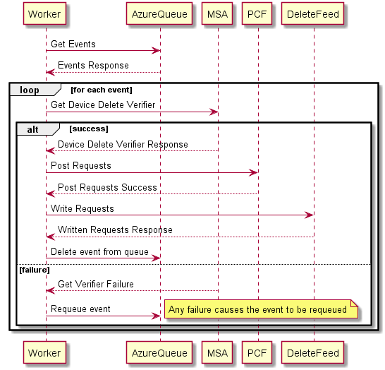

# Privacy eXperience Service: Device Delete

## Glossary of Terms

| Term   | Definition                                              |
|--------|---------------------------------------------------------|
| PXS    | Privacy Experience Service                              |
| Vortex | Real-Time telemetry event forwarding service for Asimov |
| GDPR   | General Data Protection Regulation                      |
| PCF    | Privacy Command Feed                                    |

## Requirements

Vortex Device Delete handles delete requests that come from Windows 10 devices. Users are required to be able to have
control over their data, even if they do not use a cloud connected account (such as MSA or AAD). This delete request
deletes 6 types of data associated with the device ID contained in the event:

- Device Connectivity And Configuration Data
- Product and Service Usage Data
- Product and Service Performance Data
- Software Setup and Inventory Data
- Browsing History Data
- Inking, Typing, and Speech Utterance Data

Requests must be sent to agents within 24 hours of being made.

## Data Flow

1. A client sends up a critical telemetry event
2. Vortex filters on the event name and sends them to the PXS Device Delete endpoint
3. PXS filters out duplicate requests and queues the allowed requests into an Azure Storage Queue
4. The Device Delete Worker in the PrivacyWorkerMF reads events from the queue and sends the requests to PCF and
   DeleteFeed

## Privacy View Device Delete Endpoint

The Vortex Device Delete Endpoint lives inside of the PrivacyViewMF.

### Privacy View Call Flow

1. Vortex sends a batch of events to PXS
2. PXS goes through each event and checks if it should be filtered

   

3. Returns success to Vortex if all non-filtered events could be queued

## Device Delete Worker

The Vortex Device Delete Worker handles reading events from the Device Delete Azure Storage Queue. The queue is written
to by the PrivacyViewMF [Vortex Endpoint](/Product/PXF/Core/Source/Vortex/README.md).

### Device Delete Worker Call Flow

1. Requests events in batches from the Azure Queue
2. Processes each event
    1. Pulls out device information from the request
    2. Get Device Delete Verifier from MSA
    3. Forms the individual device delete requests for:
        - Device Connectivity And Configuration Data
        - Product and Service Usage Data
        - Product and Service Performance Data
        - Software Setup and Inventory Data
        - Browsing History Data
        - Inking, Typing, and Speech Utterance Data
3. Sends the requests to PCF and DeleteFeed
4. Delete (success) or update (failure) the event in the queue

## Testing

### Unit Tests

Unit tests are ran during buddy builds.

- [Core Unit Tests](/Product/PXF/Core/UnitTests/Vortex) - Tests the core logic for Device Delete for queuing events, and
  processing and sending events to PCF and Delete Feed.

### Functional Tests

Functional Tests are ran before deployment to PF environments.

- [Functional Tests](/Product/PXF/Test/Functional/PrivacyExperience/VortexEndpointTests.cs) - Tests that Certificates
  are validated and that events are processed

### Watch Dogs

In the INT environment we have a
[WatchDog](/Product/PXF/PrivacyExperienceService/WatchDog/Source/WatchdogTests/VortexWatchdogTests.cs) running that
generates traffic on the endpoint. In [xpert](https//xpert/osg), looking at the Outgoing Service QoS on PrivacyWorkerMF
in PXS-Int you can check that events are flowing correctly.

| API Name                          | What it means                                                                     | If Missing                                           |
|-----------------------------------|-----------------------------------------------------------------------------------|------------------------------------------------------|
| DeleteMessage.devicedeleterequest | Confirms that events are being removed from the queue when successfully processed | Investigate, some reason events aren't making it E2E |
| GetMessage.devicedeleterequest    | Called to get events from the queue                                               | Investigate, worker isn't starting                   |
| UpdateMessage.devicedeleterequest | Called when a event needs to be retried on failure                                | No Action Needed, no events need requeuing           |
| GetGdprDeviceDeleteVerifier       | Called to get a verifier token from MSA                                           | Investigate, some reason events aren't making it E2E |

If events aren't showing up in the PrivacyWorkerMF the next place to look is the PrivacyViewMF Incoming Service QoS.
Followed by Outgoing Service QoS.

| API Name                       | What it means                                                                 | If Missing                                                               |
|--------------------------------|-------------------------------------------------------------------------------|--------------------------------------------------------------------------|
| VortexIngestionDeviceDelete    | Endpoint is being called by the Watch Dog                                     | Investigate, the Watch Dog is not running the VortexWD                   |
| AddMessage.devicedeleterequest | Events are making it through the filter logic and being queued for the worker | Investigate, failure is happening causing no events to make it to Worker |

These same diagnostics steps can be used when looking at PROD environments as well to determine why events are not
making it through E2E.

## Monitoring and Alerts

### View from PXS

There's a dedicated page to Vortex Device Delete that can be found on
[Xpert](https://xpert/osg/views/Vortex%20Device%20Delete).

No alerts are based on this view and it is purely informational. Alerts from the PXS side use the Incoming QoS and
Outgoing QoS alerts that already exist.

### View from Vortex

To see how it looks from Vortex, there's an additional view created by the Vortex team that can be found on
[Xpert](https://xpert/osg/views/Asimov%20Event%20Forwarder%20Subscribers/a1dec133-9e08-4ebc-ad42-afb4d32ae6b0).

Multiple alerts are based on this view:

| Name                               | Description                                                                               |
|------------------------------------|-------------------------------------------------------------------------------------------|
| Vortex Events Expiring             | Event(s) were not processed by PXS within the TTL                                         |
| Vortex Event Dropped From Response | PXS returned an error code which caused Vortex to give up on sending the event            |
| Vortex Queue Bytes                 | Byte count of queue on Vortex side is high indicating PXS is processing events too slow   |
| Vortex Queue Depth                 | The number of events in the queue have grown indicating PXS is processing events too slow |
| Vortex Buffer Drop                 | Events were dropped since the buffer on the Vortex machine was full for PXS               |